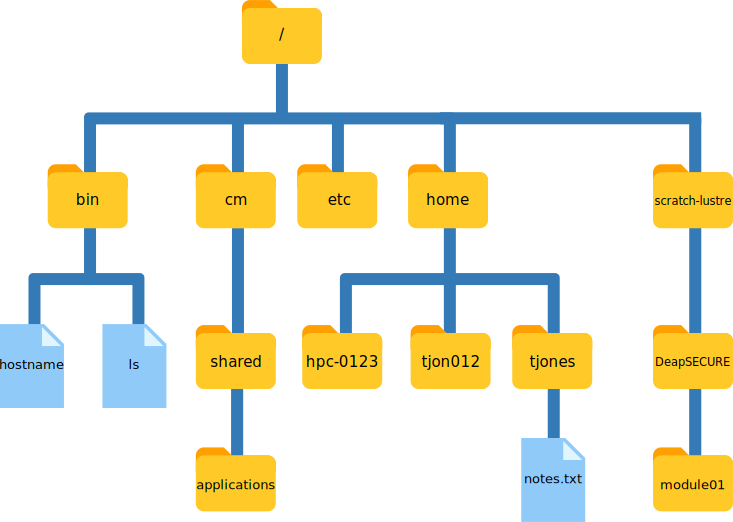

## The Command Line
_What's the first thing you think of when you hear this?_
Go to **www.menti.com** with code **9132 7354**
<!-- https://www.albionresearch.com/tools/urlencode -->


---
## Results
<div style='position: relative; padding-bottom: 56.25%; padding-top: 35px; height: 0; overflow: hidden;'><iframe sandbox='allow-scripts allow-same-origin allow-presentation' allowfullscreen='true' allowtransparency='true' frameborder='0' height='315' src='https://www.mentimeter.com/embed/c92cb2f99d7edcaa0b0be2a177c5f231/1edf2d837bdd' style='position: absolute; top: 0; left: 0; width: 100%; height: 100%;' width='420'></iframe></div>
---
## What is the command line?
- A text based interface to a computer. <!-- .element: class="fragment" -->
- A programming language.<!-- .element: class="fragment" -->
- A tool with strengths and weaknesses. <!-- .element: class="fragment" -->

---
## Quick demo
<div class="asciicast">
    <!--
    {
        "URL": "casts/task1.cast",
        "idle_time_limit": 0.5, 
        "start":12,
        "speed":1.5,
        "poster": "npt:1:23"
    } 
    -->
</div>

---
## Why use it?

- A lot of great tools are command line only!<!-- .element: class="fragment" -->

- Different tools can be combined easily. <!-- .element: class="fragment" -->

- Tasks can be automated easily using shell scripts. <!-- .element: class="fragment" -->

---
## Why don't people just make a GUI?
- CMD tools are easier and faster to create. <!-- .element: class="fragment" -->
- They're also more flexible. <!-- .element: class="fragment" -->
---
## Using the command line
---
## Walking the filesystem


---
## Paths
```bash
/bin/ls
/cm/shared/applications/
/home/tjones/notes.txt
```
- A way to specify a file or folder with a text string
- We use them to tell commands where to look for files and folders
- Note the similarity to URLs

---
## Absolute Paths

- When they start with `/` they're **absolute** i.e 
```bash 
/bin/ls
```
These always refer to a specific location. 
A bit like a GPS coordinate.
---
## Relative Paths

Relative paths are specified relative to the current directory.
```bash
tjones/notes.txt
../hpc-0123/data.hdf5 #goes one level up
```
More like a giving someone directons, 'From here, go left then right'
---
### Looking around: ls and pwd
```bash
pwd # print your 'present working directory' 
# i.e where you are right now.
ls # List the files and folders in the pwd
```
---

## Getting around
```shell
$ cd / # go to the root directory
$ cd   # go to your home directory
$ cd ~ # go to your home directory
$ cd ~/foo  # go to some folder in your home directory
$ cd /cm/shared/applications/ # go to an absolute path
$ cd ../  # go up one level from wherever you are
$ cd ../../  # go up two levels from wherever you are
```
---
## Looking in files

```console
$ cat file # outputs a file to the terminal 
$ nano file # opens a file for basic editing
```
To save the file in nano press `CTRL-O` (O for output) then press `ENTER`
To exit press `CTRL-X`

---
## Messing around

```bash
$ mkdir folder # makes a directory
$ mv file1 folder/file2 # moves and renames
$ cp file1 folder/file2 # copies and renames
$ rm file #deletes the file permanently
# be careful with rm!
```
---
## Getting stuck
If you can't figure out how to use a command
i.e git

Quick refreshser
```bash
git --help
git -h # some older commands only accept -h
```

Offline Manual
```bash
man git # press down to read and then q to exit
```
Or just google it, that's what I usually do.
---
Ok now you try!

[tomhodson.github.io/command_line_slides/task1](https://tomhodson.github.io/command_line_slides/task1)

Slides at

[tomhodson.github.io/command_line_slides](https://tomhodson.github.io/command_line_slides)

---
<!-- .slide: data-background-iframe="https://tomhodson.github.io/command_line_slides/task1" data-background-interactive data-background-transition="zoom"-->
---
### Demo of task 1
<div class="asciicast">
    <!--
    {
        "URL": "casts/task1.cast",
        "poster": "npt:2:30",
        "font-size": "0.5em",
        "idle_time_limit": 0.5
    } 
    -->
</div>
---
### A more complex command

```bash
$ git commit --dry-run -m "My commit message"
```
---
<!-- .slide: data-background-iframe="https://www.explainshell.com/explain?cmd=git+commit+--dry-run+-m+%22My+commit+message%22+" data-background-interactive data-background-transition="zoom"-->
---
### Scripting
Putting multiple commands together in a file makes a shell script. 
---
## A Simple Script
```bash
#!/usr/bin/env bash
cd ~
mkdir filesize
cd filesize
echo "numpy" > requirements.txt
echo "# File Size" > README.md
mkdir filesize
cp ~/somewhere_else/filesize.py filesize/filesize.py
python filesize/filesize.py README.md
```

---
## Script Arguments
```bash
#!/usr/bin/env bash
echo Hello World
echo You invoked this script with $# arguments
echo The first one was $1
variable=42
echo The variable is ${variable}
```
<div class="asciicast">
    <!--
    {
        "URL": "casts/example_script.cast",
        "poster": "npt:2:30",
        "font-size": "0.5em",
        "idle_time_limit": 0.5
    } 
    -->
</div>

---
### Running a script
```bash
sh my_script.sh
```
Or
```bash
chmod +x my_script.sh # just the first time
./my_script.sh
```

---
### For loops
```bash
#!/usr/bin/env bash
for python_file in *.py
do
    echo $python_file # prints the filename
    echo -------------
    cat $python_file # outputs its contents
done
echo I printed all the python files
```

---
### Task 2

[tomhodson.github.io/command_line_slides/task2](https://tomhodson.github.io/command_line_slides/task2)
---
<!-- .slide: data-background-iframe="https://tomhodson.github.io/command_line_slides/task2" data-background-interactive data-background-transition="zoom"-->
---
### Demo of me doing task 2
<div class="asciicast">
    <!--
    {
        "URL": "casts/task2.cast",
        "poster": "npt:2:30",
        "font-size": "0.6em",
        "idle_time_limit": 2, 
        "start":0
    } 
    -->
</div>

---
### Useful tools

---
### package managers
- `apt-get` (linux)
- `brew` (mac)
- `pip` (python) 
- `conda` (python + other)
- `npm` (javascript)
- and many many others

---
## Pipes
```bash
# this prints any line that contains string_to_find
cat *.py | grep string_to_find
```

---
## Environment variables
Like global variables in python.
```bash
$ export name=value
$ echo $name
value
$ echo $HOME
/Users/tom
$ env #prints all variables
```

---
## Downloading things
```bash
$ curl url # make almost any kind of HTTP request
$ wget url # many differenet ways to download things
$ youtube-dl # automated youtube video downloader
```
---
## Done!


